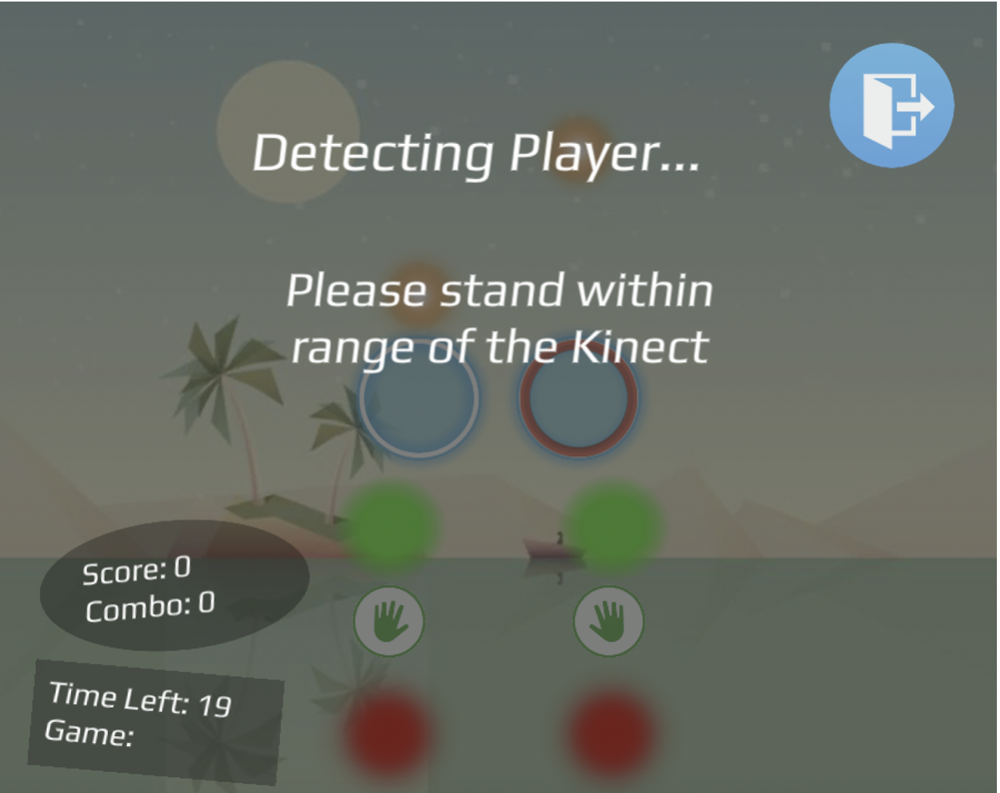
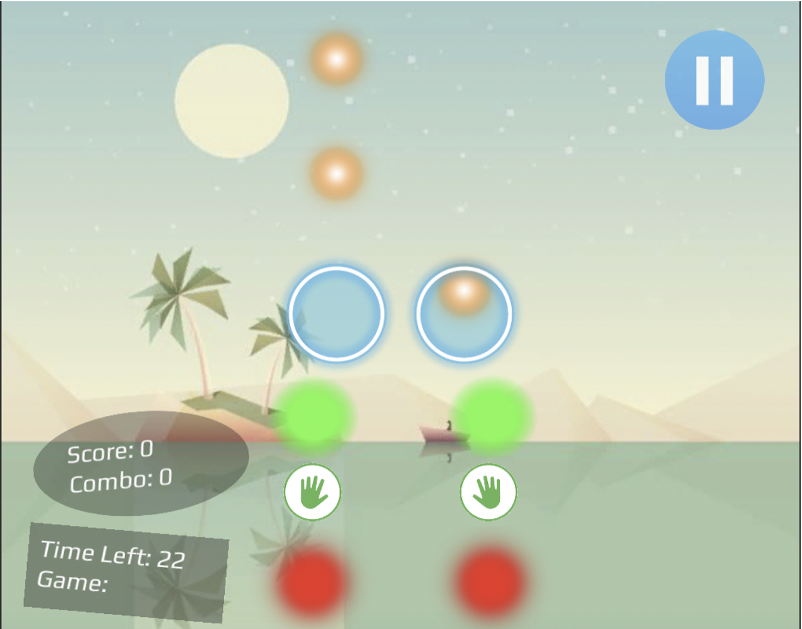
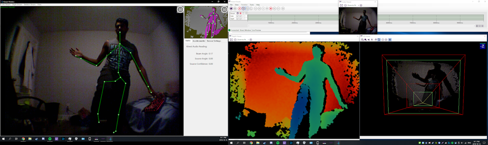

# Kinect the Rhythm
Turns hospital rehabilitation therapy sessions into a fun and engaging activity using the Xbox Kinect.
Built using Kinect SDK 1.8, Unity 3D and C#

# The Scenario
Physical therapy is an important routine for recovering patients at hospitals. It is usually led in a 
group session where patients follow direct instructions on how to perform physical exercises to 
regain muscle strength following incidents such as stroke. In collaboration  with 
[Saint-Vincent Hospital](https://www.bruyere.org/en/s-saint-vincent-hospital), we built Kinect the Rhythm
to make rehabilitation therapy more enjoyable for the patients.

# Core Features
- Intuitive, User Friendly and Minimal Assistance
- Physical and Mental Stimulation
- Data logging (for staff to track the progression of their patients)
- Skeletal Tracking (through the Kinect SDK)
- Depth Tracking (through the Kinect SDK)
